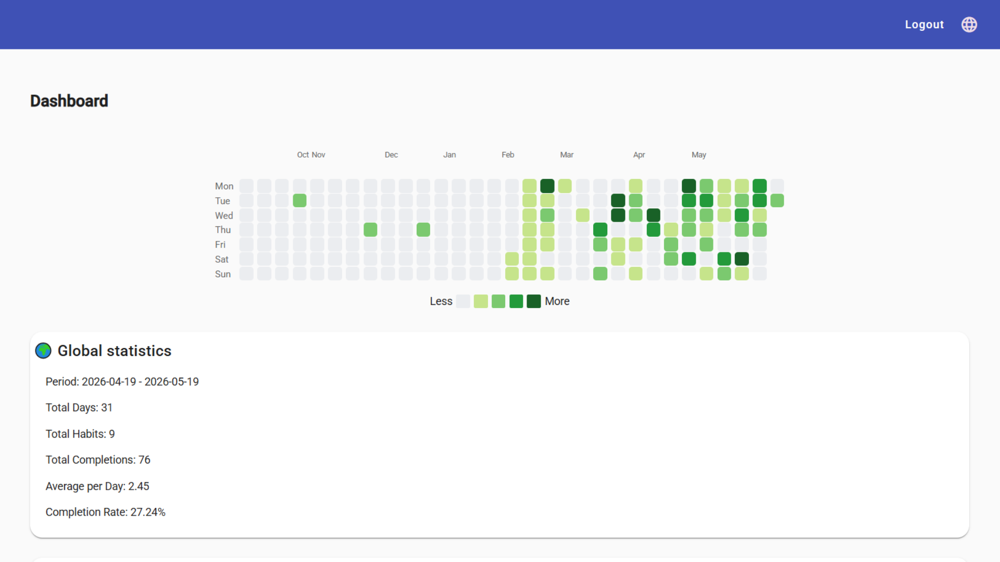
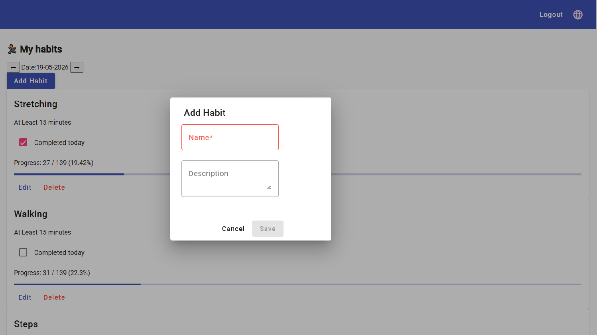
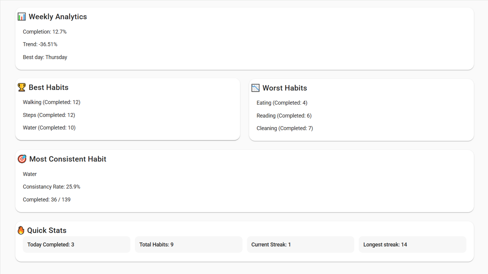
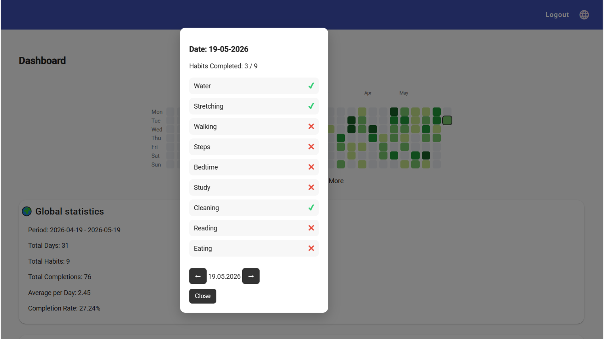

# Habit Tracker App

A full-stack habit tracking application that helps users build and maintain daily habits through tracking, analytics, and visual insights.

---

## 🚀 Tech Stack

### Backend
- .NET 8
- Entity Framework Core
- PostgreSQL
- JWT Authentication
- Clean architecture (Controller → Service → Repository)

### Frontend
- Angular (Standalone components)
- Angular Material
- RxJS
- Signals (Angular reactive state)

---

## 📊 Features

- User registration and login (JWT authentication)
- Secure password validation (custom rules)
- Habit creation, editing, and deletion
- Daily habit tracking system
- Heatmap visualization (GitHub-style activity map)
- Dashboard analytics:
  - Current streak
  - Longest streak
  - Best day
  - Most consistent habit
  - Weekly statistics
- Global exception handling (backend)
- Refresh token authentication
- Form validation (frontend + backend)

---

## 🧠 Architecture Overview

### Backend Structure
- Controllers → API layer
- Services → business logic layer
- Repositories → data access layer

### Frontend Structure
- Components → UI layer
- Services → API communication
- Models → TypeScript models
- Shared → validators & utilities

The project follows a clean separation of concerns to ensure maintainability and scalability.

---

## 📸 Screenshots

### Dashboard

### Habits

### Statistics

### Toggle Habit Modal

---

## ⚙️ How to Run Locally

### Backend

dotnet run

Make sure PostgreSQL is running and connection string is configured in appsettings.json.

### Frontend

npm install
ng serve

Frontend runs on http://localhost:4200

### Future Improvements
Skeleton loading UI improvements
Habit reminders / notifications
Mobile responsiveness polish
Export statistics (PDF/CSV)
Habit categories and tags
Dark mode refinement

### Author

Built as a full-stack learning and portfolio project to demonstrate skills in .NET backend development and Angular frontend architecture.
